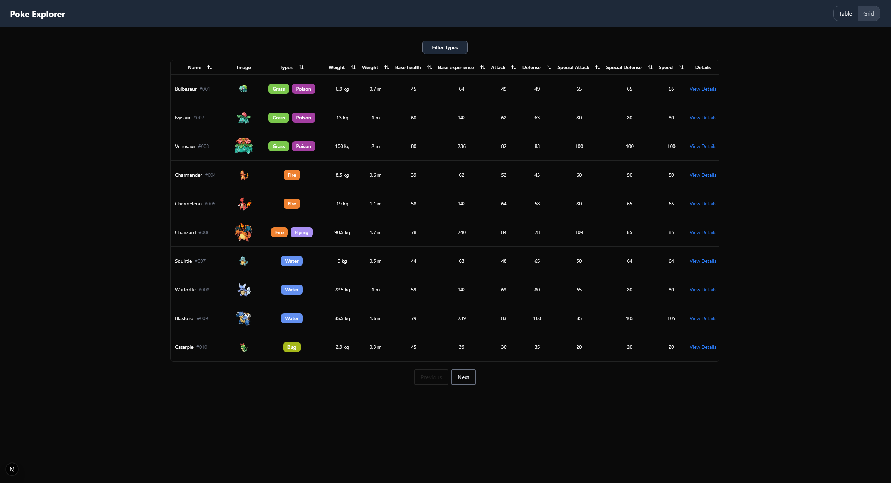
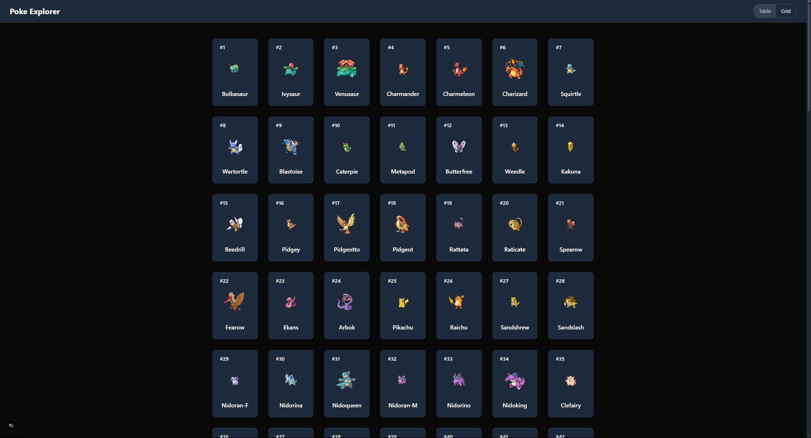
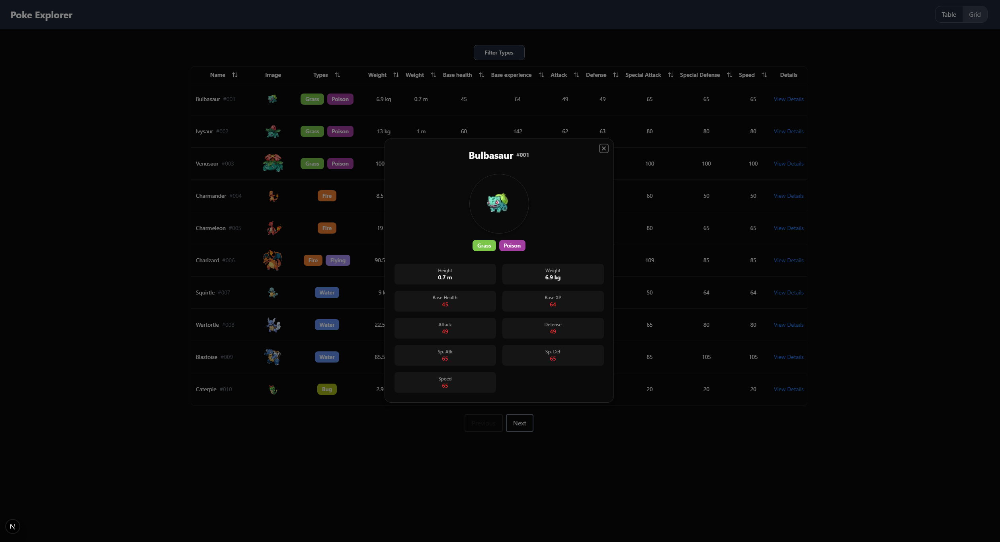

# 🧭 Poke Explorer

**Poke Explorer** is a Pokémon browser built with **React**, **Next.js**, **Tailwind CSS**, **TypeScript**, **TanStack Table**, and **ShadCN UI**.

### ✨ Features:

- Pokemon table with type filters and column sorter
- Responsive grid layout of Pokémon
- Modal with detailed Pokémon info
- Stat color indicators based on average comparison

---

## 🚀 Live Demo

🔗 [View Demo on Vercel](https://poke-explorer-nzone56s-projects.vercel.app)

---

## 🖼 Screenshots





---

## ⚙️ Requirements

- **Node.js v22 or higher**
- Package manager: npm (recommended), yarn, pnpm, or bun

---

## 🛠️ Getting Started

Follow these steps to run the project locally:

```bash
# 1. Clone the repository
git clone https://github.com/Nzone56/PokeExplorer.git

# 2.Make sure you have Node 22
nvm use 22

# 3. Install dependencies
npm install
# or: yarn install / pnpm install / bun install

# 4. Run the development server
npm run dev
```
